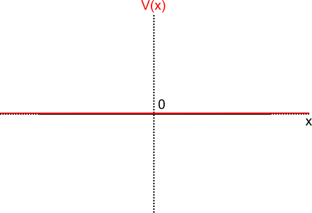
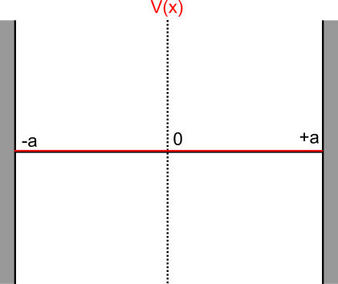
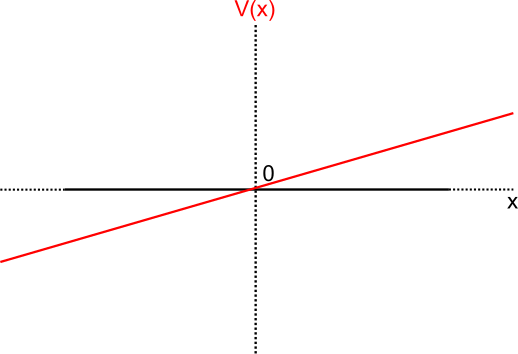
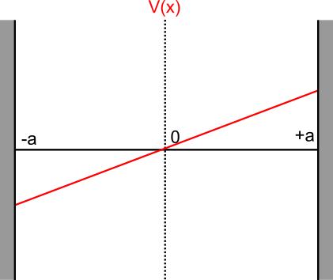

# Illustrative problems in Brownian motion 
(Solved using the Fokker-Planck equation)

**Author**: Bhaskar Kumawat

**Outline**
- [Illustrative problems in Brownian motion](#illustrative-problems-in-brownian-motion)
  - [Flat Potential over an infinite domain](#flat-potential-over-an-infinite-domain)
    - [Setup](#setup)
    - [Solution](#solution)
  - [Flat potential on a bounded domain with reflecting boundaries](#flat-potential-on-a-bounded-domain-with-reflecting-boundaries)
    - [Setup](#setup-1)
    - [Stationary solution](#stationary-solution)
    - [Time-dependent solution](#time-dependent-solution)
  - [Linear potential over an infinite domain](#linear-potential-over-an-infinite-domain)
    - [Setup](#setup-2)
    - [Solution](#solution-1)
  - [Linear potential on a bounded domain with reflecting boundaries](#linear-potential-on-a-bounded-domain-with-reflecting-boundaries)
    - [Setup](#setup-3)
    - [Solution](#solution-2)

## Flat Potential over an infinite domain

### Setup

In the absence of a potential gradient, the drift speed of the Brownian particle is zero and the Fokker-Planck equation for its probability distribution is given by,

$$\frac{\partial p(x,t)}{\partial t} = D \frac{\partial ^2p(x,t)}{\partial x^2}$$ (1)

Let us assume that the particle starts out at $x=0$, this implies that the probability distribution $p(x,0)$ is given by,

$$p(x,0)=\delta (x),\\ \text{The F.T is given by } p(k,0) = 1$$ (2)

### Solution
Let $p(k,t)$ be the spatial Fourier-transform of $p(x,t)$ given by,

$$p(k,t)=\int_{-\infin}^{\infin}e^{-ikx}p(x,t)\;dx$$ (3)

Applying the F.T (3) to both sides of equation (1) gives,

$$\frac{\partial p(k,t)}{\partial t} = -Dk^2 p(k,t)$$ (4)

The general solution of  (4) is given by,

$$p(k,t)=p(k,0) \; e^{-Dk^2t} = e^{-Dk^2t}$$ (5)

Taking a reverse fourier transform gives,

$$p(x,t)=\frac{1}{2\pi} \int_{-\infin}^{\infin} e^{ikx-Dk^2t} dk$$ (6)

To solve (6), we need to complete the square in the exponent to give,

$$p(x,t) = \frac{1}{2\pi} e^{\left(\frac{ix}{2\sqrt{Dt}}\right)^2} \int_{-\infin}^{\infin} e^{-\left(k\sqrt{Dt}-\frac{ix}{2\sqrt{Dt}}\right)^2} dk$$ (7)

Transforming $\omega=k\sqrt{Dt}-\frac{ix}{2\sqrt{Dt}}$, and $\frac{d\omega}{dk}=\sqrt{Dt}$

$$p(x,t) = \frac{1}{2\pi\sqrt{Dt}} e^{\left(\frac{ix}{2\sqrt{Dt}}\right)^2} \int_{-\infin}^{\infin} e^{-\omega^2} d\omega\\
\implies p(x,t) = \frac{1}{\sqrt{4\pi Dt}} e^{\left(\frac{ix}{2\sqrt{Dt}}\right)^2} = \frac{e^{-\frac{x^2}{4Dt}}}{\sqrt{4\pi Dt}}$$ (8)

The initial delta distribution thus spreads out over the entire space. 

---

## Flat potential on a bounded domain with reflecting boundaries

### Setup

Let the brownian particle (with no potential gradient) be bound by reflecting walls at $x=\{ -a,a \}$. In this case, the _probability current_ on both walls of the domain should be zero at all times. This implies,

$$J(-a,t) = J(a,t)=0$$ (9)

Where $J(x,t)$ is the probability current on the domain that can be obtained from (1) as,

$$ \frac{\partial p(x,t)}{\partial t} = - \frac{\partial J(x,t)}{\partial x} \\ \implies J(x,t) = -D \frac{\partial p(x,t)}{\partial x}$$ (10)

Thus, for the probability current to be zero at $x=\{-a,a\}$, 

$$\left. \frac{\partial p(x,t)}{\partial x} \right|_{x=-a} = \left. \frac{\partial p(x,t)}{\partial x} \right|_{x=a} = 0 $$ (11)

This signifies that the slope of the probability function should be zero at both the boundaries. We must thus solve equation (1) with boundary conditions in (11) and an initial value described by (2). 

### Stationary solution

Under a stationary distribution, $p(x,t)\rightarrow p(x)$. Equation (1) is then,

$$ D\frac{\partial^2 p(x)}{\partial x^2} = 0 \\ 
\implies \frac{\partial p(x)}{\partial x}=c_1 \\
\implies p(x) = c_1 x + c_2$$  (12)

Where $c_1$ and $c_2$ are constants.

The only way for (12) to satisfy the boundary condition in (11) is if $c_1=0$. In addition, the normalization condition for $p(x)$ ($\int_{-a}^{a} p(x)=1$) gives the solution,

$$ p(x) = \frac{1}{2a} $$ (13)

### Time-dependent solution

Let the time dependent solution for the above system be given by, 

$$p(x,t)=X(x)T(t)$$ (14)

Then, equation (1) implies,

$$ X \dot{T}  =DT\ddot{X}$$ (15)

Where the dot notation is used to denote a derivative with respect to the relevant variable. Rewriting this, we get

$$ \frac{\dot{T}}{T} = D \frac{\ddot{X}}{X}$$ (16)

Both sides of this equation are dependent on two different variables and hence must be equal to the same constant (say $k$). Then, the equation can be separated as,

$$\dot{T} = kT \text{ and } \ddot{X} = \frac{k}{D} X$$ (17)

The general solution for both equations are given by,

$$ T(t) = c e^{kt}$$ (18)
$$ X(x) = c_1 e^{x\sqrt{k/D}} + c_2 e^{-x\sqrt{k/D}}$$ (19)

The zero current boundary conditions in (11) imply,

$$\left. \frac{\partial X}{\partial x} \right|_{x=\pm a}=0$$ (20)

A non-trivial solution for equations (19) and (20) is possible only when the constant $k$ is negative, which results in complex exponents in equation (19). Thus, equation (19) can be rewritten in the following form without loss of generality,

$$X(x)=c_1 \cos{\frac{\omega x}{D}}+c_2 \sin{\frac{\omega x}{D}}$$ (21)

Where $k=-\omega^2$ . Substituting (21) in the boundary conditions defined by (20) gives (and taking $\gamma=\omega/D$),

$$ \left. \frac{\partial X}{\partial x} \right|_{x=a} = -c_1 \gamma \sin(\gamma a)+c_2 \gamma \cos(\gamma a) = 0 \\

\left. \frac{\partial X}{\partial x} \right|_{x=-a} = c_1 \gamma \sin(\gamma a)+c_2 \gamma \cos(\gamma a) = 0
$$ (22)

For a non-trivial solution of $X(x)$, $c_1$ and $c_2$ cannot be zero simultaneously. As $c_2=c_1 tan(\gamma a)$ from the first equation, the only possible way to get a non-trivial solution is if,  

$$c_2=0 \text{ and } \sin(\gamma a)=0$$ (23)

Which means that,

$$\gamma = \frac{n\pi}{a}\\
\implies \omega = \frac{n\pi D}{a}\\
\implies k = -\left(\frac{n\pi D}{a}\right)^2$$ (24)

$X(x)$ is in turn given by,

$$X(x) = c_1 \cos\left(\frac{n\pi x}{a}\right), \text{where } n\in \{\pm 1,\pm 2...\}$$ (25)

The full solution can now be written as,

$$p_n(x,t)=a_n \cos\left(\frac{n \pi x}{a}\right) \; e^{-t\left(\frac{n\pi D}{a}\right)^2}$$

Where $p_n$ is the nth normal mode with a normalizing constant $a_n$. We can write the full distribution as a superposition of all these modes, thus obtaining

$$p(x,t)= a_0 + \sum_{n=1}^\infin a_n \cos\left(\frac{n \pi x}{a}\right) \; e^{-t\left(\frac{n\pi D}{a}\right)^2}$$ (26)

To satisfy the initial condition, 

$$ p(x,0) = a_0 + \sum_{n=1}^\infin a_n \cos\left(\frac{n \pi x}{a}\right) = \delta(x)$$ (27)

Thus, the coefficients $a_0,a_1,...$ etc. are just the cosine coefficients of $\delta(x)$ and are given by,

$$ a_0 = \frac{1}{2a} \int_{-a}^{a} \delta(x) dx = \frac{1}{2a} \\
a_n = \frac{1}{a} \int_{-a}^{a} \delta(x) cos\left(\frac{n\pi x}{a}\right) = \frac{1}{a}$$ (28)

The overall solution is thus,

$$p(x,t)= \frac{1}{2a} + \frac{1}{a} \sum_{n=1}^\infin \cos\left(\frac{n \pi x}{a}\right) \; e^{-t\left(\frac{n\pi D}{a}\right)^2}$$ (29)

As expected, all modes except the zeroth vanish after some time. The exponential decay rate of the first mode, $(\pi D/a)^2$ determines the rate at which the relaxation to the stationary solution is observed.

---

## Linear potential over an infinite domain

### Setup

Let the potential be of the form,

$$V(x) = f_0x$$ (30)
 
The force on the particle, $\nabla V(x)$ is then $f_0$ and under the assumption of an overdamped medium the particle drifts at a velocity ($v_0$) given by,

$$v_0 = \frac{f_0}{\eta}$$ (31)

Where $\eta$ is the friction coefficient in the medium. The Fokker-Planck equation for such a particle is given by, 

$$\frac{\partial p(x,t)}{\partial t} = -v_0 \frac{\partial p(x,t)}{\partial x} + D\frac{\partial^2p(x,t)}{\partial x^2}$$ (32)

### Solution

Once again, taking a fourier transform $p(k,t) = \int_{-\infin}^{\infin}e^{-ikx}p(x,t)$ on both sides gives us,

$$ \frac{\partial p(k,t)}{\partial t} = v_0 ik p(k,t) - Dk^2 p(k,t)$$ (33)

Integrating, we get

$$ p(k,t) = e^{(v_0ik-Dk^2)t}$$ (34)

Where, $p(k,0)=1$ due to the initial condition. Consequently, we can take an inverse Fourier transform to get,

$$ p(x,t) = \frac{1}{2\pi} \int_{-\infin}^{\infin} e^{ikx+v_0ikt-Dk^2t} dk$$ (35)

Taking $x-v_0t=\tilde{x}$, we can integrate as in equation (7) to get, 

$$p(x,t) = \frac{e^{-\frac{(x-v_0t)^2}{4Dt}}}{\sqrt{4\pi D t}}$$

So, the probability distribution behaves similar to the one in a flat potential, except it drifts with a constant velocity $v_0$.

---

## Linear potential on a bounded domain with reflecting boundaries

### Setup

In the case of a reflecting wall on both ends, the zero current condition in equation (9) applies again. The probability current in this case is, however, obtained from equation (32) as

$$ J(x,t) = v_0p(x,t)-D\frac{\partial p(x,t)}{\partial x}$$ (35)

and must be zero at $x=\pm a$. 

$$ \left[v_0p(x,t)-D\frac{\partial p(x,t)}{\partial x}\right]_{x=\pm a} = 0$$ (36)

### Solution

Assuming a separable solution of form $p(x,t)=X(x)T(t)$, the Fokker-Planck equation reads,

$$ X\dot{T} = -v_0T\dot{X}+DT\ddot{X} $$ (37)

The time dependent and space dependent parts must thus be separately equal to a constant $k$, such that

$$ \dot{T} = kT$$ (38)
$$\ddot{X}-\frac{v_0}{D}\dot{X}-\frac{k}{D}X=0$$ (39)

Substituting $X(x) = e^{\alpha x}$ in equation (39),

$$ e^{\alpha x} \left(\alpha^2-\frac{v_0}{D}\alpha-\frac{k}{D}\right)=0$$ (40)

Where the term on the right is the characteristic equation in this case. For non-trivial solutions, it must be equal to zero, implying

$$ \alpha = \frac{v_0 \pm \sqrt{v_0^2+4kD}}{2D}$$ (41)

The general solution for (39) is the superposition of these two values of $\alpha$, i.e.,

$$ X(x) =c_1 e^{(\beta+\gamma) x}+c_2e^{(\beta-\gamma) x}$$ (42)

Where $\gamma = \sqrt{v_0^2+4kD}/2D$ and $\beta=v_0/2D$. Substituting this solution in the boundary conditions in equation (36) yields,

$$ $$

