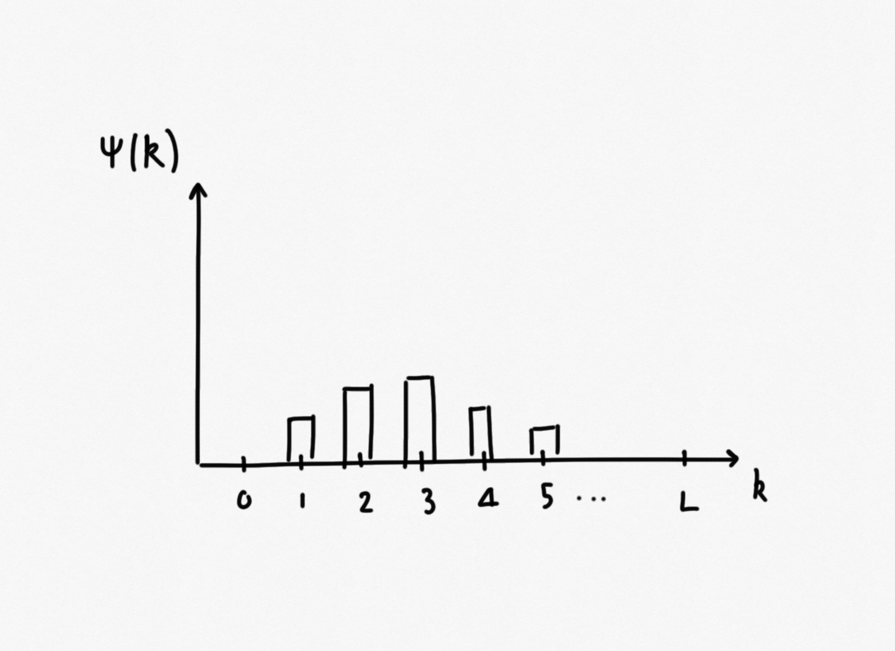

# Diffusion in Hamming space

**Author**: Bhaskar Kumawat

Consider a fixed-size population consisting of $N$ organisms, each with a _genotype_ composed of $L$ sites that can be in one of two states&mdash;0 or 1. Let $k$ denote the number of $1$s present in a particular genome, and $n_k$ is the number of organisms in the population with $k$ $1$s in their genome. Thus,

$$N = \sum_k n_k$$ (1)

We define a quantity $k_{av}$ that tracks the average number of $1$s for genomes in the population. Thus,

$$k_{av} = \frac{\sum_k kn_k}{N}$$ (2)

The distribution $\psi(k)=n_k$ thus determines the distribution of the population in Hamming space. 

### Resampling without mutation

The population is resampled every generation to create a new population. Thus, assuming no mutation, the probability of observing a set of $n_k$ values at generation $t+1$ can be expressed as a multinomial distribution of the form,

$$P\left[n_0(t+1),n_1(t+1),...|n_0(t),n_1(t)...\right] = \frac{N!}{\prod_k n_k(t+1)!} \frac{\prod_k \left[n_k(t)^{n_k(t+1)}\right]}{N^N}$$

### Mutation without resampling

In the absence of resampling, mutations can change the observed number of sequences with $k$ ones after one generation. 

