---
format:
    html:
        page-layout: article
---

## Current Research

### Evolving evolvable bacteriophage
::: {style="font-size:11pt;"}
*Chapter 3, Doctoral dissertation (Advisor: Dr. Luis Zaman)*
:::
::: {.grid}
::: {.g-col-8}

::: {.justify}
In the [first](http://localhost:4042/research.html#computational-evolution-of-evolvability) [two](http://localhost:5085/research.html#dynamic-localization-on-genotype-spaces-in-changing-environments) chapters of my dissertation, we show that environmental change can lead to increased evolvability as it pushes the population towards evolvable regions of the genotype space. In the third chapter, we are testing this hypothesis experimentally in a biological system and using the results to develop a proof-of-concept method for creating evolvable bacteriophage (viruses that infect bacterial hosts). Briefly, we evolve different wild isolates of bacteriophage under changing host conditions and then test their ability to infect alternate hosts after multiple rounds of evolution.
:::

::: {style="font-size:11pt;"}
*(Experiments underway)*
:::

:::

::: {.g-col-4}
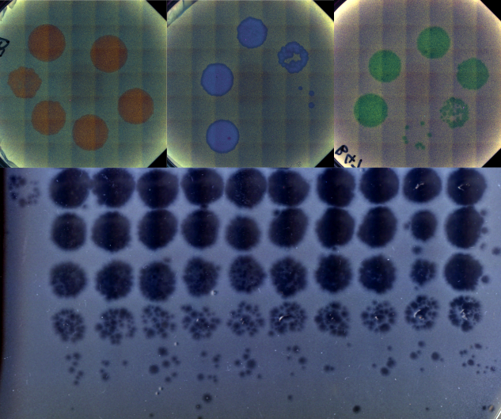
:::

:::

### Dynamic localization on genotype spaces in changing environments
::: {style="font-size:11pt;"}
*Chapter 2, Doctoral dissertation* \
*(Advisors: Dr. Luis Zaman & Dr. Jordan Horowitz)*
:::
::: {.grid}
::: {.g-col-7}
::: {.justify}
In [chapter one](http://localhost:4042/research.html#computational-evolution-of-evolvability) of my dissertation, we highlight a process where evolving lineages find and localize on areas of the genotype space that are located between two phenotypes in changing environments. This process, which we are calling *dynamic localization*, promotes evolvability by providing the population quick mutational access to alternative phenotypes. In this project, we work out the theoretical conditions (specifically, the values of mutation rate, population size, and the rate of environmental change) under which populations are likely to show such localization using a [recently developed analytical formalism](https://journals.aps.org/prresearch/abstract/10.1103/PhysRevResearch.6.023070). Additionally, we use computational simulations on real biological landscape data to predict the structural features of areas of a genotype-phenotype map that harbor this localization.
:::

::: {style="font-size:11pt;"}
*(Manuscript in preparation)*
:::

:::

:::{.g-col-5}
::: {.light-content}
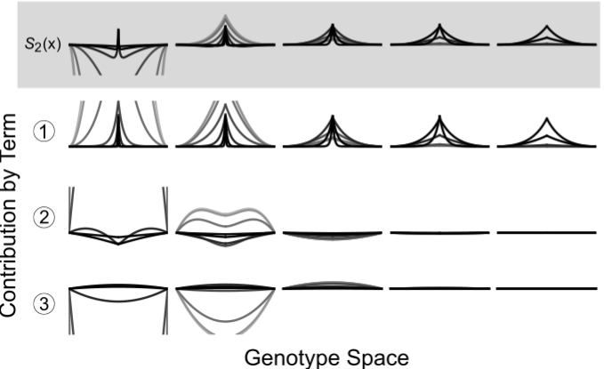
:::

::: {.dark-content}
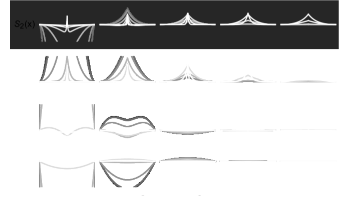
:::
:::

:::

### An engineered optogenetic phage susceptibility switch in *E. coli*
::: {style="font-size:11pt;"}
*Summer project with undergraduate student Jenny Sun*\
*(Mentored by me for the EEB Abe Scholars Summer Program)*
:::
::: {.grid}
::: {.g-col-7}
::: {.justify}
Bacteriophage (viruses that infect bacteria) generally require very specific surface proteins (receptors) on a host to infect and propogate. By coupling an two-component optogenetic system with an inverter circuit that can express one of two such phage receptors, we are building a bacterial host that can switch between suscpectibility to different phage when stimulated with red or green light signals. As a graduate mentor, I am training the student, Jenny Sun, on basic molecular biology and cloning protocols, along with methods to characterize the performance of this optogenetic system. 
:::

::: {style="font-size:11pt;"}
*(Experiments underway)*
:::

:::

:::{.g-col-5}
::: {.light-content}
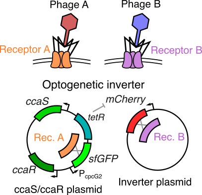{width=80% fig-align="center"}
:::

::: {.dark-content}
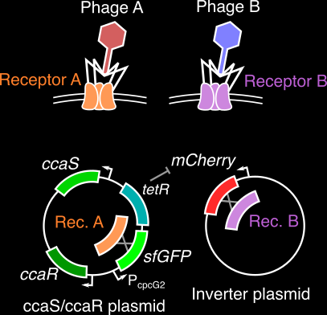{width=80% fig-align="center"}
:::
:::

:::

## Previous research

### Computational evolution of evolvability
::: {style="font-size:11pt;"}
*Chapter 1, Doctoral dissertation (Advisor: Dr. Luis Zaman)*
:::

::: {.grid}
::: {.g-col-8}
:::{.justify}
The evolutionary processes that shape an organism's ability to adapt (or *evolvability*) remain elusive and an open area of research in evolutionary biology. Using evolving, self-replicating computer programs, we show that multiple pathways to increased evolvability can emerge concurrently and aid adaptation in distinct ways. One of these pathway (an evolved mutational landscape) allows rapid adaptation to previously seen environments, while the other (higher mutation rates) allows rapid adaptation to entirely new environments. We also find a direct, environment-regulated interaction between the evolution of the mutational landscape and the mutation rate. This multifaceted picture of evolvability helps us understand how organisms deal with ever-changing conditions and relentlessly explore nature’s opportunities for innovation.
:::

::: {style="font-size:11pt;"}
[Publication](https://doi.org/10.1073/pnas.2413930121){.external target="_blank"}
:::

:::
::: {.g-col-4}
::: {.light-content}
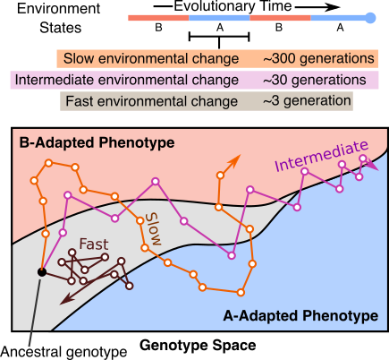
:::

::: {.dark-content}
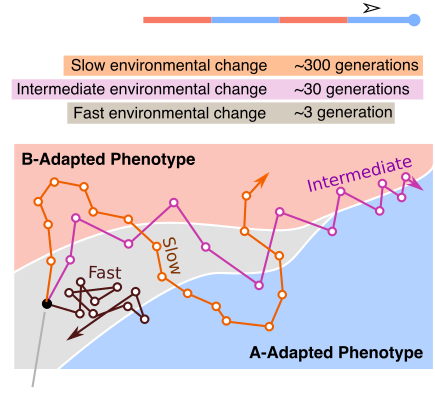
:::
:::
:::

### Coevolved complexity and the genotype-phenotype map
::: {style="font-size:11pt;"}
*Masters thesis project (Advisor: Dr. Luis Zaman)*
:::

::: {.grid}
::: {.g-col-8}
::: {.justify}
Seemingly simple looking biological systems tend to be extremely complex under the surface. Whether this complexity has a direct adaptive benefit or if it arises as a byproduct of other processes is a fundamental question in evolutionary biology. In this project, I demonstrate that a host population may increase in phenotypic complexity (defined here as the rarity of a phenotype) when evolving with a parasite, even if these complex host phenotypes are not adaptive. This increase in complexity is directly coupled to the structure of the genotype-phenotype map for both hosts and parasites. Rare or difficult to attain phenotypes can essentially act as protected reservoirs for host populations, thus preventing easy invasion by the parasites and leading to an indirect increase in host complexity.
:::

::: {style="font-size:11pt;"}
[Publication](https://doi.org/10.1162/isal_a_00386){.external target="_blank"}
:::

:::
::: {.g-col-4}
::: {.light-content}
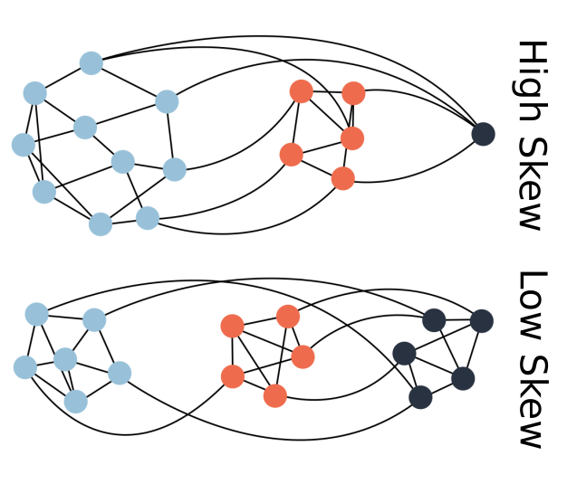{width=90% fig-align="center"}
:::
::: {.dark-content}
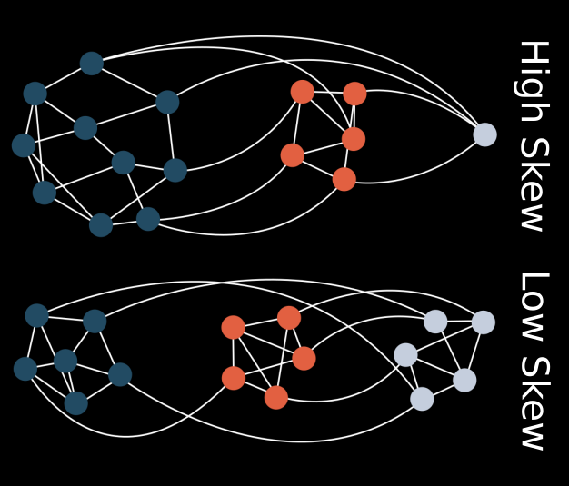{width=90% fig-align="center"}
:::
:::
:::

### Evolution of cooperation in digital organisms
::: {style="font-size:11pt;"}
*Undergraduate thesis project (Advisor: Dr. Ramray Bhat)*
:::

::: {.grid}
::: {.g-col-7}
::: {.justify}
What are the factors that make single-celled organisms cooperate and take the first step towards living in an ensemble? This question inspired me to model inter-cellular cooperation in the form of a sharing of metabolic products in digital organisms in Avida (a computational evolution framework). I found that increased resource abundance, when paired with high mutation rates and population sizes, enabled the evolution of metabolic sharing between these digital organisms, thus laying the groundwork for future cooperation, and even multicellularity.
:::

::: {style="font-size:11pt;"}
[Publication](https://doi.org/10.1186/s12862-021-01782-0){.external target="_blank"}
:::
:::
::: {.g-col-5}

::: {.light-content}
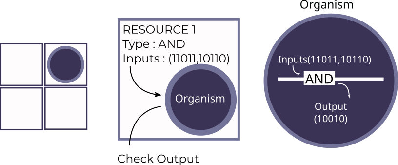{width=90% fig-align="center"}
:::
::: {.dark-content}
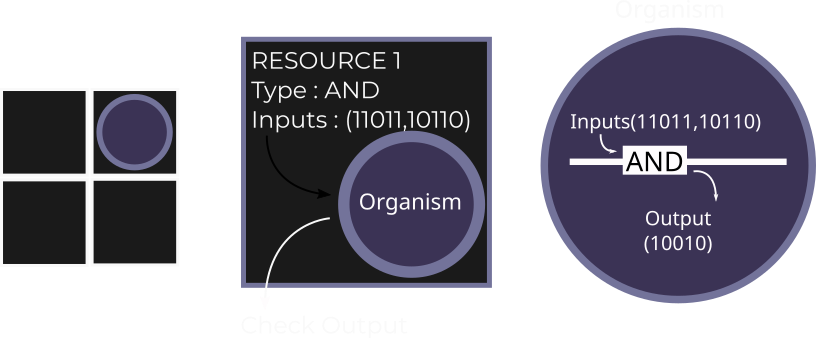{width=90% fig-align="center"}

:::
:::
:::

### Genetically engineered machines
::: {style="font-size:11pt;"}
*Undergraduate summer projects* \
*(Advisors: Dr. Dipshikha Chakravortty, Dr. Sandeep M. Eswarappa, & Dr. Umesh Varshney)*
:::

::: {.grid}
::: {.g-col-8}
::: {.justify}
*PhageShift (iGEM 2018)*---Bacteriophage (viruses that infect bacteria) are extremely efficient predators, but lose efficacy over time due to evolution of resistance. As the leader of the 2018 iGEM team from IISc, I led a team of 23 undergraduates through a multi-component project that developed better anti-bacterial phages, aiming to prevent bacterial resistance to phage therapy, and to allow quicker immune clearance of pathogenic bacteria using engineered phage. We were awarded a gold medal and a best software tool nomination for this project at the iGEM 2018 Giant Jamboree. 
:::
::: {style="font-size:11pt;"}
[Project website](https://2018.igem.org/Team:IISc-Bangalore){.external target="_blank"}
:::

:::

::: {.g-col-4}
::: {.light-content}
{fig-align="center" width=50%}
:::
::: {.dark-content}
{fig-align="center" width=50%}
:::
:::
:::

::: {.grid}
::: {.g-col-8}
::: {.justify}
*iFLOAT (iGEM 2017)*---Haloarcheal gas vesicles are tiny, proteinaceous, gas filled particles that allow haloarchea to adjust their buoancy in water. While the use of these gas vesicles for synthetic biology applications has been proposed before, we found that these vesicles fail to float under *in vitro* conditions. In this project, we engineered gas vesicles to improve their buoyancy and to allow their use in the purification of recombinant proteins. My role as a team member involved molecular cloning, mathematical modelling of gas vesicle flotation, and performing flotation assays to verify our model. We were awarded a gold medal and a best hardware nomination for this project at the iGEM 2017 Giant Jamboree.
:::

::: {style="font-size:11pt;"}
[Project website](https://2017.igem.org/Team:IISc-Bangalore){.external target="_blank"}
:::

:::
::: {.g-col-4}
::: {.light-content}
{fig-align="center" width=90%}
:::
::: {.dark-content}
{fig-align="center" width=90%}
:::
:::
:::

## Other interests 
Apart from the research above, some other questions that interest are as follows.

::: {.justify}
1. Self-replicating structures in the lab or in computational systems tend to show exact replication, without any room for change between generations (as this change usually hinders the ability to self-replicate). How did *replication involving replicable imperfections* (prebiotic evolvability?) first arise starting from such simple and fragile replicators? ([Some preliminary work on this idea](https://kumawatb.github.io/lifefromscratch/){target="_blank"})

2. Evolving populations move on an abstract, high dimensional network called the *genotype space*, consisting of all possible mutational permutations of an organism's genome. What are some universal features of biological genotype spaces? Can we use directed evolution protocols to navigate these spaces in a predictable way?

3. How does the presence of interactions, especially between hosts and parasites, drive the evolution of species at the molecular level, in their respective genotype spaces?

4. What evolutionary change do engineered synthetic circuits undergo as they replicate and persist in a target population? How close to an adaptive optimum are such synthetic biology systems? Can directed evolution help us make them more robust?
:::
